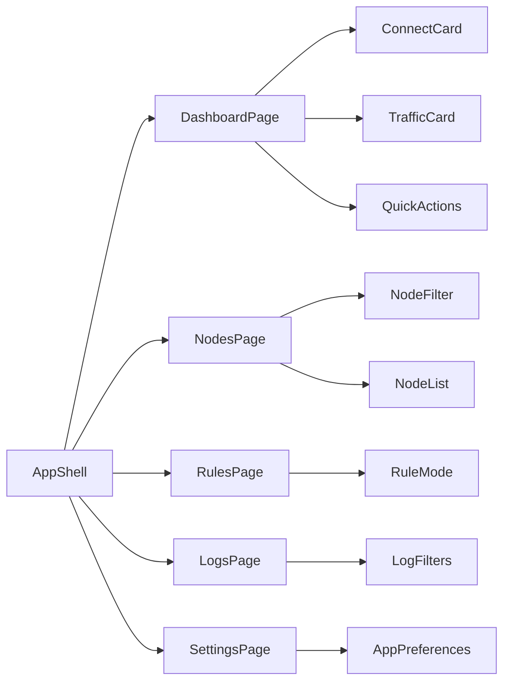

# Wateray Adaptive UI Specification

## Layout Breakpoints

- Compact: width < 700
  - Bottom `NavigationBar`
  - Single-column content
- Medium: 700 <= width < 1100
  - Left `NavigationRail`
  - Main content panel
- Expanded: width >= 1100
  - Left `NavigationRail`
  - Main content panel
  - Right status panel (core state + quick info)

## Primary Navigation

- Dashboard
- Nodes
- Rules
- Logs
- Settings

The destination set is fixed across platforms to keep user memory stable.

## Information Architecture

## Interaction Rules

- Core actions (`start`, `stop`, `reload`) are async and non-blocking.
- Connection CTA is always visible on Dashboard.
- Node switch action is available in Dashboard and Nodes.
- Rule mode switch is one tap/click away from root navigation.
- Logs are read-only in MVP, with copy/export reserved for follow-up.
